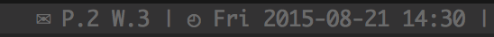

# Tmux maildir counter

Plugin that counts files on a specific mail directory.

If you use [offlineimap](http://offlineimap.org/) to synchronize your emails with your computer,
you can use this plugin to count how many emails you have in a specific folder and display in your tmux
left or right status bar.

Shows how many unread emails I have in both my personal and work accounts:


### Usage

Add the list of folders you want to count to your `tmux.conf`. All folders must be separated by `|`.

```tmux.conf
set -f @maildir_counters '~/Mail/Personal/INBOX/new|~/Mail/Work/INBOX/new'
```

Then, add the `maildir_counter` to your left/right status bar where `N` is the index of the folder you want to show.

```tmux.confi
set -g status-right 'Personal: #{maildir_counter_1}, Work: #{maildir_counter_2} | %a %Y-%m-%d %H:%M'
```

### Installation with Tmux Plugin Manager (recommended)

Add plugin to the list of TPM plugins:

```tmux.conf
set -g @plugin 'erickpintor/tmux-maildir-counter'
```

Press prefix + I to install it.

### Manual Installation

Clone the repo:

```bash
$ git clone https://github.com/erickpintor/tmux-maildir-counter.git ~/clone/path
```

Add this line to your .tmux.conf:

```tmux.conf
run-shell ~/clone/path/tmux-maildir-counter.tmux
```

Reload TMUX environment with:

```bash
$ tmux source-file ~/.tmux.conf
```

### License

[MIT](LICENSE)
